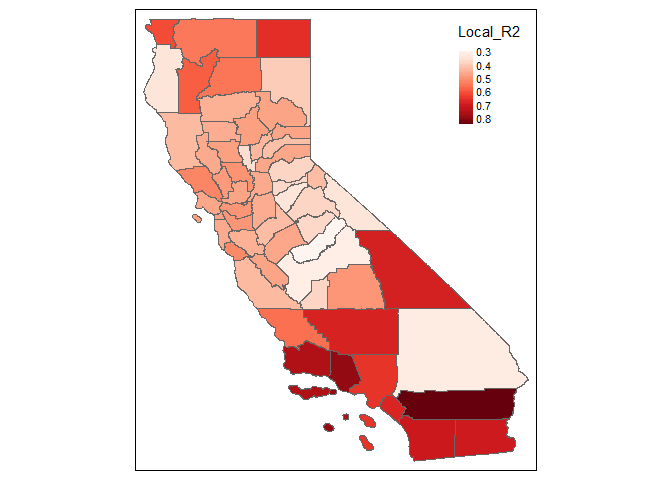
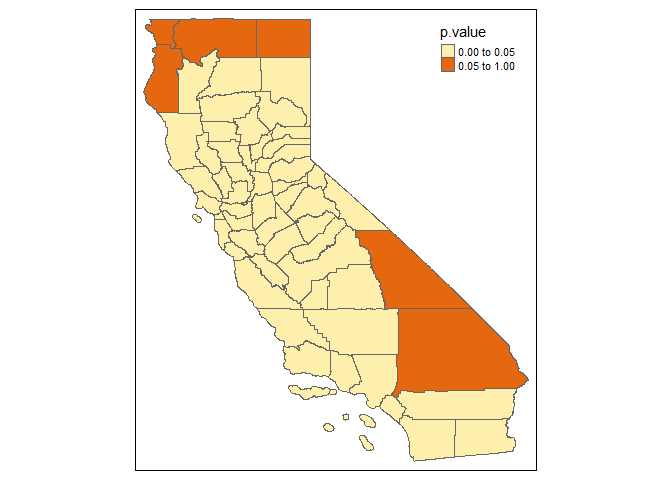
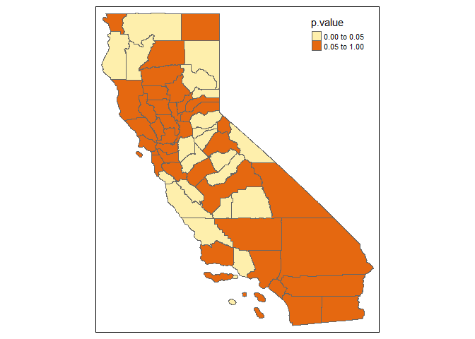
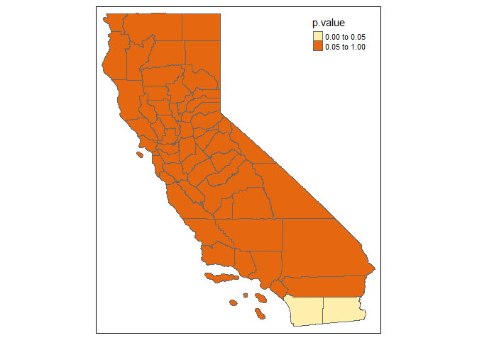

<!-- README.md is generated from README.Rmd. Please edit that file -->

# GWPR.light

<!-- badges: start -->

[](https://travis-ci.com/MichaelChaoLi-cpu/GWPR.light)
[](https://github.com/MichaelChaoLi-cpu/GWPR.light/actions)
[](https://ci.appveyor.com/project/MichaelChaoLi-cpu/GWPR.light)
<!-- badges: end -->

This package includes the function for the optimal bandwidth selection
in GWPR, the function for GWPR, the function for the local Hausman test,
the function for the local F test for individual effects, the function
for the local Lagrange Multiplier Breusch-Pagan test, and the function
for panel Moran’s I test. The functions have been optimized, which
require the less memory in the calculation.

## Author

Chao Li <chaoli0394@gmail.com> Shunsuke Managi
<managi@doc.kyushu-u.ac.jp>

## Maintainer

Chao Li <chaoli0394@gmail.com>

## Installation

You can install the released version of GWPR.light from
[CRAN](https://CRAN.R-project.org) with:

``` r
install.packages("GWPR.light")
```

## Example

This is a basic example which shows you how to solve a common problem:

``` r
library(GWPR.light)
library(tmap)
## basic example code
data(TransAirPolCalif)
data(California)
formula.GWPR <- pm25 ~ co2_mean + Developed_Open_Space_perc + Developed_Low_Intensity_perc +
   Developed_Medium_Intensity_perc + Developed_High_Intensity_perc +
   Open_Water_perc + Woody_Wetlands_perc + Emergent_Herbaceous_Wetlands_perc +
   Deciduous_Forest_perc + Evergreen_Forest_perc + Mixed_Forest_perc +
   Shrub_perc + Grassland_perc + Pasture_perc + Cultivated_Crops_perc +
   pop_density + summer_tmmx + winter_tmmx + summer_rmax + winter_rmax
```

This is an example about GWPR.moran.test:

``` r
pdata <- plm::pdata.frame(TransAirPolCalif, index = c("GEOID", "year"))
moran.plm.model <- plm::plm(formula = formula.GWPR, data = pdata, model = "within")
#summary(moran.plm.model)

bw.AIC.F <- bw.GWPR(formula = formula.GWPR, data = TransAirPolCalif, index = c("GEOID", "year"), SDF = California,
                     adaptive = F, p = 2, bigdata = F, effect = "individual",
                     model = "within", approach = "AIC", kernel = "bisquare", longlat = F,
                     doParallel = T, cluster.number = 4)
#> To make sure every subsample have enough freedom, the minimun numbers of individuals is 2 
#> The upper boundary is 12.23978 , and the lower boudnary is 1.435436 
#> ..................................................................................
#> You use parallel process, so be careful about your memory usage. Cluster number: 4 
#> Fixed Bandwidth: 8.112889 AIC score: 2468.518 
#> Fixed Bandwidth: 5.562329 AIC score: 1993.051 
#> Fixed Bandwidth: 3.985996 AIC score: 1507.388 
#> Fixed Bandwidth: 3.011769 AIC score: 1098.755 
#> Fixed Bandwidth: 2.409663 AIC score: 802.8273 
#> Fixed Bandwidth: 2.037541 AIC score: 613.6641 
#> Fixed Bandwidth: 1.807557 AIC score: Inf 
#> Fixed Bandwidth: 2.179679 AIC score: 680.1113 
#> Fixed Bandwidth: 1.949695 AIC score: Inf 
#> Fixed Bandwidth: 2.091833 AIC score: 640.8903 
#> Fixed Bandwidth: 2.003987 AIC score: Inf 
#> Fixed Bandwidth: 2.058279 AIC score: 623.5577 
#> Fixed Bandwidth: 2.024725 AIC score: 607.2684 
#> Fixed Bandwidth: 2.016804 AIC score: 604.0248 
#> Fixed Bandwidth: 2.011908 AIC score: 601.4765 
#> Fixed Bandwidth: 2.008883 AIC score: Inf 
#> Fixed Bandwidth: 2.013778 AIC score: 602.001 
#> Fixed Bandwidth: 2.010752 AIC score: 601.1515 
#> Fixed Bandwidth: 2.010038 AIC score: Inf 
#> Fixed Bandwidth: 2.011194 AIC score: 601.2757 
#> Fixed Bandwidth: 2.01048 AIC score: Inf 
#> Fixed Bandwidth: 2.010921 AIC score: 601.199 
#> Fixed Bandwidth: 2.010648 AIC score: 601.1222 
#> Fixed Bandwidth: 2.010584 AIC score: 601.1041 
#> Fixed Bandwidth: 2.010544 AIC score: 601.0928 
#> Fixed Bandwidth: 2.010519 AIC score: Inf 
#> Fixed Bandwidth: 2.010559 AIC score: 601.0971 
#> Fixed Bandwidth: 2.010535 AIC score: 601.0902 
#> Fixed Bandwidth: 2.010529 AIC score: 601.0886

# moran's I test
GWPR.moran.test(moran.plm.model, SDF = California, bw = bw.AIC.F, kernel = "bisquare",
                 adaptive = F, p = 2, longlat=F, alternative = "greater")
#> $statistic
#> [1] 3.174358
#> 
#> $p.value
#> [1] 0.0007508427
#> 
#> $Estimated.I
#> [1] 0.002129923
#> 
#> $Excepted.I
#> [1] -0.01754386
#> 
#> $V2
#> [1] 3.841174e-05
#> 
#> $alternative
#> [1] "greater"
# The statistic is significantly greater than 0. Therefore, the residuals are spatially clustered.
```

GWPR example:

``` r
result.F.AIC <- GWPR(bw = bw.AIC.F, formula = formula.GWPR, data = TransAirPolCalif, index = c("GEOID", "year"),
                     SDF = California, adaptive = F, p = 2, effect = "individual", model = "within",
                     kernel = "bisquare", longlat = F)
#> ************************ GWPR Begin *************************
#> Formula: pm25  =  co2_mean + Developed_Open_Space_perc + Developed_Low_Intensity_perc + Developed_Medium_Intensity_perc + Developed_High_Intensity_perc + Open_Water_perc + Woody_Wetlands_perc + Emergent_Herbaceous_Wetlands_perc + Deciduous_Forest_perc + Evergreen_Forest_perc + Mixed_Forest_perc + Shrub_perc + Grassland_perc + Pasture_perc + Cultivated_Crops_perc + pop_density + summer_tmmx + winter_tmmx + summer_rmax + winter_rmax  -- Individuals: 58 
#> Bandwidth: 2.010529  ----  Adaptive: FALSE 
#> Model: within  ----  Effect: individual 
#> The R2 is : 0.8969606 
#> Note: in order to avoid mistakes, we forced a rename of the individuals'ID as "id".
summary(result.F.AIC$SDF$Local_R2)
#>    Min. 1st Qu.  Median    Mean 3rd Qu.    Max. 
#>  0.2899  0.4272  0.4676  0.4928  0.5375  0.8467
tm_shape(result.F.AIC$SDF) +
  tm_polygons(col = "Local_R2", pal = "Reds",auto.palette.mapping = F,
              style = 'cont')
#> Warning: The argument auto.palette.mapping is deprecated. Please use midpoint
#> for numeric data and stretch.palette for categorical data to control the palette
#> mapping.
#> Warning in sp::proj4string(obj): CRS object has comment, which is lost in output
#> Linking to GEOS 3.9.0, GDAL 3.2.1, PROJ 7.2.1
```



Example of F test:

``` r
GWPR.pFtest.resu.F <- GWPR.pFtest(formula = formula.GWPR, data = TransAirPolCalif, index = c("GEOID", "year"),
                                  SDF = California, bw = bw.AIC.F, adaptive = F, p = 2, effect = "individual",
                                  kernel = "bisquare", longlat = F)
#> **************************** F test in each subsample *********************************
#> Formula: pm25  =  co2_mean + Developed_Open_Space_perc + Developed_Low_Intensity_perc + Developed_Medium_Intensity_perc + Developed_High_Intensity_perc + Open_Water_perc + Woody_Wetlands_perc + Emergent_Herbaceous_Wetlands_perc + Deciduous_Forest_perc + Evergreen_Forest_perc + Mixed_Forest_perc + Shrub_perc + Grassland_perc + Pasture_perc + Cultivated_Crops_perc + pop_density + summer_tmmx + winter_tmmx + summer_rmax + winter_rmax  -- Individuals: 58 
#> Bandwidth: 2.010529  ----  Adaptive: FALSE 
#> Model: Fixed Effects vs Pooling  ----  Effect: individual 
#> If the p-value is lower than the specific level (0.01, 0.05, etc.), significant effects exist.
tm_shape(GWPR.pFtest.resu.F$SDF) +
     tm_polygons(col = "p.value", breaks = c(0, 0.05, 1))
#> Warning in sp::proj4string(obj): CRS object has comment, which is lost in output
```



Example of Locally Breusch-Pagan Lagrange Multiplier Test:

``` r
GWPR.plmtest.resu.F <- GWPR.plmtest(formula = formula.GWPR, data = TransAirPolCalif, index = c("GEOID", "year"),
                                    SDF = California, bw = bw.AIC.F, adaptive = F, p = 2,
                                    kernel = "bisquare", longlat = F)
#> **************** Breusch-Pagan Lagrange Multiplier test in each subsample *******************
#> Formula: pm25  =  co2_mean + Developed_Open_Space_perc + Developed_Low_Intensity_perc + Developed_Medium_Intensity_perc + Developed_High_Intensity_perc + Open_Water_perc + Woody_Wetlands_perc + Emergent_Herbaceous_Wetlands_perc + Deciduous_Forest_perc + Evergreen_Forest_perc + Mixed_Forest_perc + Shrub_perc + Grassland_perc + Pasture_perc + Cultivated_Crops_perc + pop_density + summer_tmmx + winter_tmmx + summer_rmax + winter_rmax  -- Individuals: 58 
#> Bandwidth: 2.010529  ----  Adaptive: FALSE 
#> Model: Pooling  ----  
#> If the p-value is lower than the specific level (0.01, 0.05, etc.), significant effects exist.
tm_shape(GWPR.plmtest.resu.F$SDF) +
     tm_polygons(col = "p.value", breaks = c(0, 0.05, 1))
#> Warning in sp::proj4string(obj): CRS object has comment, which is lost in output
```



Example of Locally Hausman Test Based on GWPR

``` r
GWPR.phtest.resu.F <- GWPR.phtest(formula = formula.GWPR, data = TransAirPolCalif, index = c("GEOID", "year"),
                                  SDF = California, bw = bw.AIC.F, adaptive = F, p = 2, effect = "individual",
                                  kernel = "bisquare", longlat = F, random.method = "amemiya")
#> ************************* Hausman Test in each subsample ***************************
#> Formula: pm25  =  co2_mean + Developed_Open_Space_perc + Developed_Low_Intensity_perc + Developed_Medium_Intensity_perc + Developed_High_Intensity_perc + Open_Water_perc + Woody_Wetlands_perc + Emergent_Herbaceous_Wetlands_perc + Deciduous_Forest_perc + Evergreen_Forest_perc + Mixed_Forest_perc + Shrub_perc + Grassland_perc + Pasture_perc + Cultivated_Crops_perc + pop_density + summer_tmmx + winter_tmmx + summer_rmax + winter_rmax  -- Individuals: 58 
#> Bandwidth: 2.010529  ----  Adaptive: FALSE 
#> Model: Fixed Effects vs Random Effects  ----  Effect: individual  ----  Random Method: amemiya 
#> If the p-value is lower than the specific level (0.01, 0.05, etc.), one model is inconsistent.
tm_shape(GWPR.phtest.resu.F$SDF) +
     tm_polygons(col = "p.value", breaks = c(0, 0.05, 1))
#> Warning in sp::proj4string(obj): CRS object has comment, which is lost in output
```


